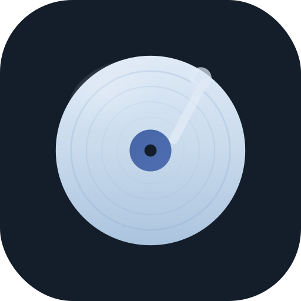
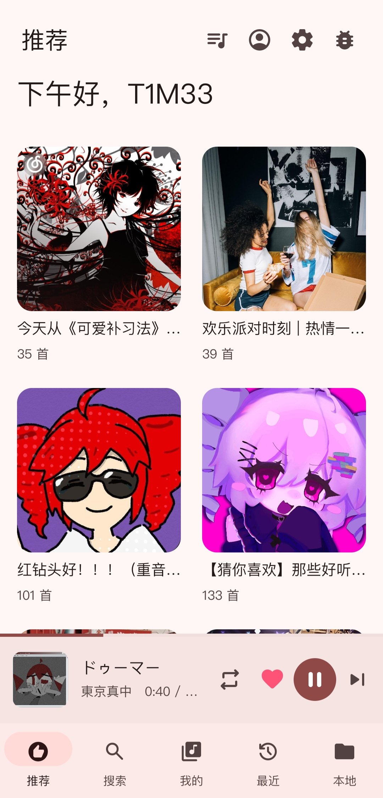
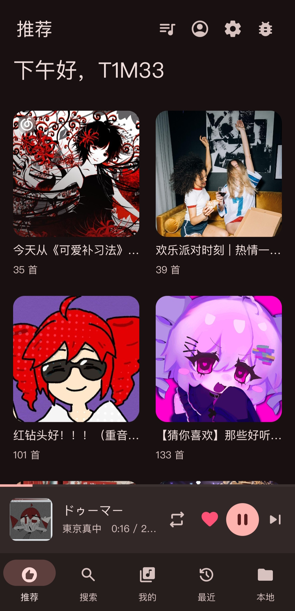
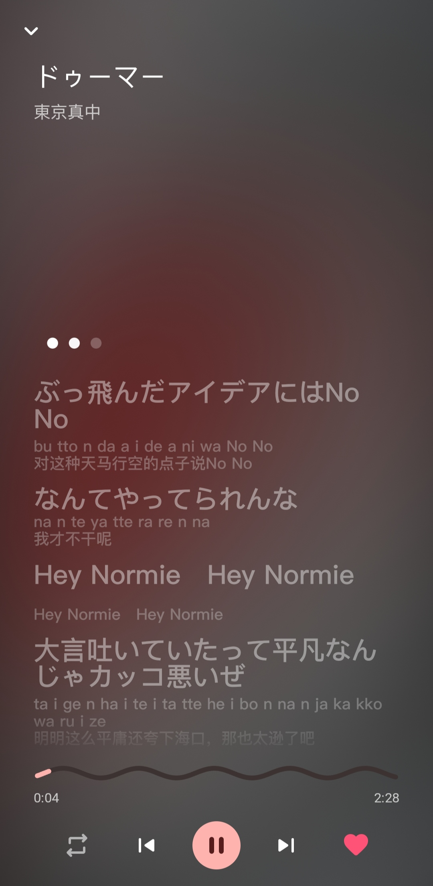
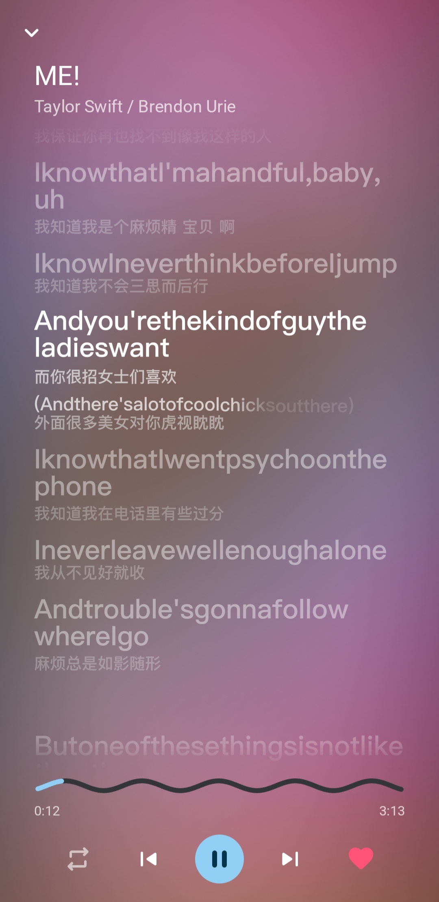

<p align="center">
  
</p>

<h1 align="center">QPlayer</h1>

<p align="center">
  <a href="README.md">简体中文</a> · <b>English</b>
</p>

<p align="center">
  <b>A cross-platform NetEase Cloud Music player with a QML-rendered UI</b><br>
  Powered by <a href="https://github.com/TIMER-err/qml4j">qml4j</a>
</p>

<p align="center">
  
  
  
  
  <a href="LICENSE.md"></a>
</p>

---

<p align="center">
  
  
  
  
</p>
<p align="center">
  <sub>Home · light (Monet) &nbsp;|&nbsp; Home · dark &nbsp;|&nbsp; Lyrics · per-syllable + romaji/translation &nbsp;|&nbsp; Lyrics · fluid backdrop + wavy progress</sub>
</p>

The UI uses no native Views. Every control is described in QML and rendered by qml4j — **except** the lyric-page body (per-syllable scrolling + fluid backdrop), which the host draws by hand directly through Skija, not in QML. qml4j is itself a QML runtime written in pure Java.

## Features

- End-to-end playback over the NetEase Cloud Music API: recommendations, search, user playlists, recent, and local files.
- QR login, like and unlike, a play queue, three play modes (list-loop, shuffle, repeat-one).
- Source switching: greyed-out, VIP, and trial-only tracks are matched by title and artist against an alternate source and replaced before playback (toggleable).
- Lyric page: drawn directly through Skija by the host. Per-syllable scrolling (AMLL TTML first, NetEase as a fallback), a cover-tinted fluid backdrop, romaji and translation, and a Material wavy progress bar; it can be dragged to scroll, flung with inertia, and tapped on a line to seek there.
- Material 3 UI: the whole interface is QML (`md3.Core`) running on the qml4j engine.
- Dynamic color (Monet): the theme is reseeded from the current cover (toggleable); dark, light, and follow-system modes.
- System media controls and background playback: a foreground `MediaSession` service drives the lockscreen, notification, and bluetooth transport, with auto-advance, position sync, pause-on-call, and ducking on transient focus loss.
- Responsive layout: the UI adapts to the window/screen width (MD3 breakpoints 600 / 840) — a bottom bar when narrow, a left `NavigationRail` when wide, and a playlist grid whose column count grows with width. It's width-driven, so Android landscape and tablets get it too.
- Desktop (LWJGL3): the same QML and `player-core` logic run on the desktop, windowed with GLFW and rendered with Skija. The **OpenGL / Vulkan graphics backend is switchable** at startup; a taskbar icon plus a system tray whose menu mirrors the transport; **minimizing to the tray destroys the render thread and GPU resources and rebuilds them on restore** (playback and UI state are preserved).

## Layout

| Module | Description |
|---|---|
| `player-core/` | Platform-neutral core (Maven, `dev.t1m3.qplayer`): the QML-facing `PlayerController`, NetEase API, lyric parsers (LRC / YRC / TTML), audio and metadata abstractions, plus the host-drawn lyric page (fluid SkSL backdrop + per-syllable renderer + the `LyricCompositor`). Shared by the Android shell and the desktop host so both draw identical lyrics. |
| `shared-qml/` | Shared QML: `Main.qml` + the pages + components, the vendored `md3.Core` library, and bundled fonts (PingFang / Material Symbols). At the repo root; Android and desktop load the same copy (so the responsive layout applies to both). |
| `android-shell/` | Android app (Gradle, `applicationId dev.t1m3.qplayer`, minSdk 26). Host integration in `…/android/`; the UI and lyrics come from the two shared modules above. |
| `desktop-host/` | Desktop host (Maven): an LWJGL3 + GLFW window rendered with Skija, a switchable `GraphicsBackend` (`GLBackend` / `VulkanBackend`), a disposable render thread, a system tray, and desktop audio (javax.sound + SPI decoders). |
| [qml4j](https://github.com/TIMER-err/qml4j) | The QML engine. A published dependency, **not** part of this repo. |

`qml4j-core` is resolved from Maven Central; the in-repo `player-core` / `desktop-host` modules are built locally.

## Build

Requires JDK 21; building for Android also needs the Android SDK.

**Android**

```sh
# install the shared modules to Maven Local (the Android shell consumes them via mavenLocal)
mvn -q -pl player-core -am install

# build the APK (qml4j-core resolves from Maven Central)
cd android-shell && ./gradlew :app:assembleDebug
# → app/build/outputs/apk/debug/app-debug.apk
```

**Desktop**

```sh
# build once (player-core / desktop-host)
mvn -q -pl player-core,desktop-host -am install

# run (OpenGL by default)
mvn -pl desktop-host exec:exec

# switch to the Vulkan backend / set the initial window size (try the breakpoints)
mvn -pl desktop-host exec:exec -Dgfx=vulkan
mvn -pl desktop-host exec:exec -Dwin.w=480 -Dwin.h=800   # narrow (bottom bar)
```

> The close button minimizes to the tray (the render thread is destroyed, audio keeps playing); only "Quit" from the tray exits. On macOS launch with `-XstartOnFirstThread`.

**Standalone desktop executable (GraalVM native-image)**

Needs a **GraalVM 21** JDK. The QML is AOT-compiled at build time (no runtime bytecode generation). `native-image` can't cross-compile across OS/arch, so **each platform is built on its own machine**.

```sh
# 1) install the shared module
mvn -DskipTests -pl player-core -am install

# 2) AOT-compile the QML + build the native binary → desktop-host/target/qplayer[.exe]
mvn -DskipTests -pl desktop-host -Pnative package

# 3) package into a lightweight per-platform bundle (Skija/LWJGL natives included)
bash       desktop-host/dist/package-linux.sh      # Linux   → target/QPlayer-x86_64.AppImage (single file)
pwsh -File desktop-host/dist/package-windows.ps1   # Windows → target/QPlayer-windows-x64.zip
bash       desktop-host/dist/package-macos.sh      # macOS   → target/QPlayer.dmg (host arch)
```

> The macOS `.dmg` is unsigned; distributing it needs codesign + notarization or Gatekeeper blocks it. On a `v*` tag, `.github/workflows/release.yml` runs all of the above on the three-platform CI and attaches the artifacts to the GitHub Release.

## On AI

Most of this project (QPlayer and the [qml4j](https://github.com/TIMER-err/qml4j) engine it depends on) was generated by **Claude (Opus 4.8)** through Claude Code. It is an efficiency trade-off: the project is built in my spare time, that time is limited, and vibe coding lets me do more within it. All code was reviewed by me line by line before being merged, and tested on a real device before release; the result is my responsibility. Most commits carry `Co-Authored-By: Claude`, and a "Claude" entry therefore appears in the contributors list; this is intentional, to record the extent of the AI's involvement in the project.

## Credits

- [qml4j](https://github.com/TIMER-err/qml4j) — the pure-Java QML engine that runs the UI.
- [Skija](https://github.com/HumbleUI/Skija) — Skia bindings for the JVM; the renderer and the host-drawn lyric page draw through it.
- [material-components-qml](https://github.com/sudoevolve/material-components-qml) — the Material 3 QML component library (`md3.Core`) the UI is built from (vendored, engine-adapted).
- [AMLL TTML DB](https://github.com/Steve-xmh/amll-ttml-db) — syllable-level lyrics.
- [NeteaseCloudMusicApiEnhanced](https://github.com/NeteaseCloudMusicApiEnhanced/api-enhanced) — reference for the NetEase request-encryption schemes (weapi/eapi/xeapi).
- Lyric rendering adapted from the Haedus renderer; icons are Material Symbols Rounded.

> Personal/educational project. NetEase Cloud Music is a trademark of its respective owner; this app is an unofficial client and is not affiliated with NetEase.

## License

[Apache License 2.0](LICENSE.md).
