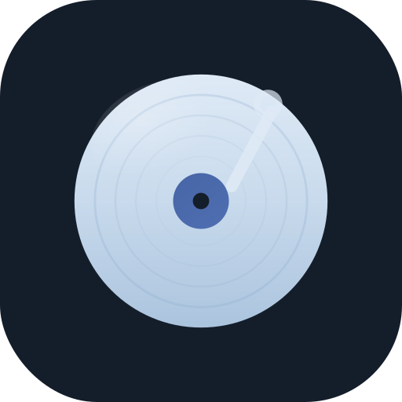
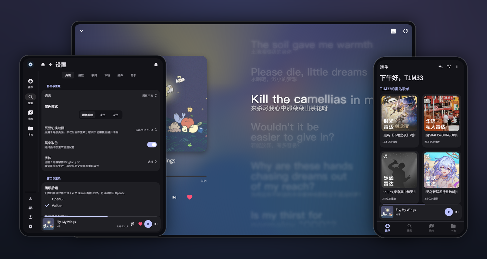
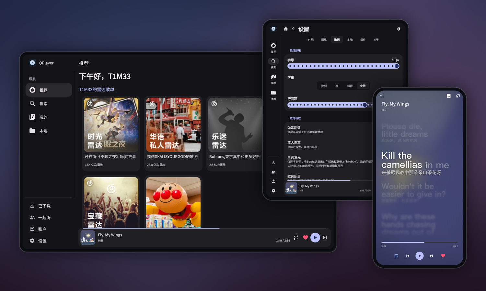

<p align="center">
  
</p>

<h1 align="center">QPlayer</h1>

<p align="center">
  <b>简体中文</b> · <a href="README.en.md">English</a>
</p>

<p align="center">
  <b>一个界面由 QML 渲染的跨平台、可扩展音乐播放器</b><br>
  由 <a href="https://github.com/TIMER-err/qml4j">qml4j</a> 强力驱动
</p>

<p align="center">
  
  
  
  
  <a href="LICENSE.md"></a>
</p>

---

<p align="center">
  
</p>
<p align="center">
  <sub>手机推荐 · 平板设置 · 桌面歌词</sub>
</p>
<p align="center">
  
</p>
<p align="center">
  <sub>桌面推荐 · 平板设置 · 手机歌词</sub>
</p>

界面不使用任何原生 View。除歌词页正文外，所有控件都由 QML 描述、经 qml4j 渲染；
歌词正文（逐字滚动 + 流体背景）由宿主通过 Skija 直接绘制，不走 QML。qml4j 本身是一个
用纯 Java 实现的 QML 运行时。

安卓与桌面加载同一份 QML 和同一套 `player-core` 逻辑，即同一个界面运行在两个宿主壳中。

<a href="https://www.star-history.com/?repos=TIMER-err%2Fqplayer&type=date&legend=top-left">
 <picture>
   <source media="(prefers-color-scheme: dark)" srcset="https://api.star-history.com/chart?repos=TIMER-err/qplayer&type=date&theme=dark&legend=top-left&sealed_token=pvVKTlOWl7Lak9qFpFBXwrZXczfPyNb2ZD6ZbfiJY2us9fPe7ck5CffvPIOKcTPhT9B6J92c16ce9UrxUIJ-hwpT4WlDEdPJJ5MFvDSvK9CTG1wry56KYPc0OyDhCujlPX35c-dFPj9xU7IqhAEkH6Xz3Q13--zsYmcC_WLSYtiPKr_Et0O9x5sj-mZr" />
   <source media="(prefers-color-scheme: light)" srcset="https://api.star-history.com/chart?repos=TIMER-err/qplayer&type=date&legend=top-left&sealed_token=pvVKTlOWl7Lak9qFpFBXwrZXczfPyNb2ZD6ZbfiJY2us9fPe7ck5CffvPIOKcTPhT9B6J92c16ce9UrxUIJ-hwpT4WlDEdPJJ5MFvDSvK9CTG1wry56KYPc0OyDhCujlPX35c-dFPj9xU7IqhAEkH6Xz3Q13--zsYmcC_WLSYtiPKr_Et0O9x5sj-mZr" />
   
 </picture>
</a>

## 结构

QPlayer 由一个播放器外壳和一套插件系统组成。

QPlayer 本体不包含在线音源，也不分发音源代码。安装 JavaScript 音源插件后，推荐、
聚合搜索、歌单、登录、喜欢、最近播放、心动模式等页面才会出现；界面按插件声明的能力
自动显隐，与原生页面一致。未安装插件时，它是一个本地播放器。

这条边界决定了后续设计：插件运行在隔离的 Rhino Realm 中，只有清单声明并经用户确认的
权限才生效；插件返回的每个字段都要通过宿主校验；插件不提供 QML，只能声明对话框的
内容，具体渲染由 QPlayer 用自身组件完成。

## 特性

**播放**　本地媒体库、播放队列、三种播放模式（列表循环 / 随机 / 单曲循环）。在线内容
统一使用 `provider:kind:id` 标识，避免多平台 ID 冲突。前台 `MediaSession` 服务接管
锁屏、通知栏与蓝牙控制，处理自动续播、进度同步、来电暂停与失焦降音。

**歌词页**　由宿主通过 Skija 直接绘制，不经 QML：逐字滚动、基于封面取色的流体背景、
罗马音与翻译、Material 波浪进度条。歌词内容来自当前音源插件或本地文件。

**界面**　整套 UI 使用 Miuix QML（`miuix.Core`），运行在 qml4j 引擎上，通过内置 `StyleManager` 将封面颜色映射到 Miuix 莫奈配色（可关闭），
支持深色 / 浅色 / 跟随系统，以及简体中文与英文。布局由宽度
驱动（断点 600 / 840）：窄屏使用底部导航，宽屏切换为左侧 `NavigationRail`，歌单
栅格列数随宽度增减，因此安卓横屏与平板无需单独适配。设置页始终使用单列分组，相关设置共用一个卡片；歌曲、歌单、搜索结果和选择器采用窗口化虚拟列表。

界面迁移说明见 [Miuix 界面](docs/miuix-ui.md)。

**桌面端**　同一套 QML 与 `player-core` 运行在 LWJGL3 + GLFW 上，由 Skija 渲染。
OpenGL 与 Vulkan 后端可在启动时切换；提供任务栏图标与系统托盘，托盘菜单镜像播放控制；
最小化到托盘时销毁渲染线程与 GPU 资源、恢复时重建，播放与界面状态保留。

**插件安全**　签名 `.qplug` 包，内置源仓库与发布者公钥固定在程序内，安装时列出权限
供用户确认，按插件隔离的 Rhino Realm、域名白名单与命名空间凭据库。插件对话框由插件
声明、QPlayer 渲染，因此跟随应用主题，且无法模仿未被授予的宿主界面。

## 凭据存储与安全边界

QPlayer 用带完整性验证的 AES-GCM 加密各插件的登录凭据，并按插件命名空间隔离；随机数据
密钥尽可能交给 Android Keystore、macOS Keychain、Windows DPAPI 或 Linux Secret
Service/KWallet 保管。系统密码库不可用时，用户可以明确选择回退到仅当前用户可读的本地密钥。

这项功能的目标是**静态文件保护**，而不是本机恶意软件防护。它可以降低凭据文件、配置
目录、备份或旧硬盘被单独复制后直接恢复登录状态的风险，也可阻止其他未提权系统账户直接
读取凭据。

> [!IMPORTANT]
> Windows DPAPI 和 Linux Secret Service/KWallet 的安全边界主要是当前用户/登录会话，
> 并不保证 QPlayer 独占访问——以同一用户身份运行的其他程序可能调用同样的系统接口，密码库
> 已解锁时尤其如此。桌面端的普通加密回退模式主要依赖文件权限，同样防不住同用户的程序。
> Android 应用沙箱和 macOS Keychain 的应用访问控制提供了更强的应用级隔离，但 root/管理员
> 权限、进程注入、调试和读取 QPlayer 运行时内存，都不在保护范围内。

## 仓库结构

| 模块 | 说明 |
|---|---|
| `player-core/` | 跨平台核心（Maven，`dev.t1m3.qplayer`）：面向 QML 的 `PlayerController`、插件 ABI 与沙箱、歌词解析（LRC / YRC / TTML）、音频与元数据抽象，以及宿主绘制的歌词页。**不含任何在线音源端点或协议实现**。 |
| `shared-qml/` | 共享 QML：`Main.qml` + 各页面 + 组件、vendored 的 `miuix.Core` 组件库、内置字体（PingFang / Material Symbols）。放在仓库根目录，两端加载同一份，响应式布局因此天然通用。 |
| `android-shell/` | 安卓应用（Gradle，`applicationId dev.t1m3.qplayer`，minSdk 26）。宿主集成在 `…/android/`，界面与歌词都来自上面两个模块。 |
| `desktop-host/` | 桌面宿主（Maven）：LWJGL3 + GLFW 开窗、Skija 渲染、可切换的 `GraphicsBackend`、可销毁重建的渲染线程、系统托盘，以及桌面音频（javax.sound + SPI 解码）。 |
| [qml4j](https://github.com/TIMER-err/qml4j) | QML 引擎。是一个已发布的依赖，**不在**本仓库内。 |

`qml4j-core` 从 Maven Central 解析，`player-core` / `desktop-host` 本地构建。

插件开发相关的 ABI、权限模型、媒体 ID、打包签名与迁移约定见
[插件开发文档](docs/plugins.md) 和 [安全模型](docs/plugin-security.md)；
另有可直接克隆的[插件模板仓库](https://github.com/TIMER-err/qplayer-plugin-template)。

## 构建

需要 JDK 21；构建安卓还需 Android SDK。

**安卓**

```sh
# 把共享模块装进 Maven Local(安卓壳通过 mavenLocal 消费)
mvn -q -pl player-core -am install

# 构建 APK(qml4j-core 从 Maven Central 解析)
cd android-shell && ./gradlew :app:assembleDebug
# → app/build/outputs/apk/debug/app-debug.apk
```

**桌面**

```sh
# 构建一次(player-core / desktop-host)
mvn -q -pl player-core,desktop-host -am install

# 运行(默认 OpenGL)
mvn -pl desktop-host exec:exec

# 切 Vulkan 后端 / 指定初始窗口大小(试响应式断点)
mvn -pl desktop-host exec:exec -Dgfx=vulkan
mvn -pl desktop-host exec:exec -Dwin.w=480 -Dwin.h=800   # 窄屏(底部导航)
```

> 关闭按钮为最小化到托盘（渲染线程销毁，音频继续播放），从托盘「退出」才会真正退出。
> macOS 启动需加 `-XstartOnFirstThread`。

**桌面分发包（jpackage + jlink）**

需要完整的 **JDK 21**（非 JRE，需包含 `jpackage`/`jlink`）。产物内置按需裁剪的运行时，
用户无需自行安装 Java。`jpackage` 只能为当前系统打包，**每个平台需在对应机器上构建**。

```sh
# 1) 安装共享模块
mvn -DskipTests -pl player-core -am install

# 2) 组装 target/app(qplayer.jar + lib/ 下全部运行时依赖)
mvn -DskipTests -pl desktop-host -Pdist package

# 3) 打成各平台分发包(jpackage 顺带 jlink 出运行时)
bash       desktop-host/dist/package-linux.sh      # Linux   → target/QPlayer-x86_64.AppImage(单文件)
pwsh -File desktop-host/dist/package-windows.ps1   # Windows → target/QPlayer-windows-x64.zip
bash       desktop-host/dist/package-macos.sh      # macOS   → target/QPlayer.dmg(随当前架构)
```

> 裁进运行时的 JDK 模块列表在 `desktop-host/dist/jre-modules.txt`，三个脚本共用。
> macOS 的 `.dmg` 未签名，对外分发需自行 codesign + 公证，否则 Gatekeeper 会拦截。
> 打 `v*` tag 时，`.github/workflows/release.yml` 会在三平台 CI 上完成上述构建并附到
> GitHub Release。

### Linux

**AppImage 使用指南**

不论是第一次安装 QPlayer 还是更新 QPlayer 都可使用（注意 AppImage 不便实现自动更新，QPlayer 发布新版本后请手动使用下列命令更新）。

```sh
# 将您新下载的 AppImage 文件替换到系统路径
mv ~/下载/QPlayer*.AppImage ~/.local/bin/qplayer.AppImage
# 赋予执行权限
chmod +x ~/.local/bin/qplayer.AppImage
```

## 发版

版本号位于**两处**，需保持一致：

- `android-shell/app/build.gradle.kts` —— `versionCode`（整数，每次 +1）和 `versionName`
- `desktop-host/pom.xml` —— `<qplayer.app.version>`（桌面分发包版本）

提交后打并推送 `v<versionName>` tag 触发 `release.yml`：签名 APK 与三平台桌面包自动构建
并附到 Release。CI 会按 `build.gradle.kts` 中声明的 `qml4j-core` 版本，从源码 clone 对应
`v*` tag 构建引擎。

## 致谢

- [qml4j](https://github.com/TIMER-err/qml4j) —— 运行整个界面的纯 Java QML 引擎。
- [Skija](https://github.com/HumbleUI/Skija) —— JVM 上的 Skia 绑定；渲染器与宿主绘制的歌词页都通过它输出。
- [miuix-qml](https://github.com/TIMER-err/miuix-qml) —— Miuix QML 组件库（`miuix.Core`），视觉参考 [compose-miuix-ui/miuix](https://github.com/compose-miuix-ui/miuix)。版本与许可见 `shared-qml/miuix/`。
- [SPlayer](https://github.com/imsyy/SPlayer) —— 流体歌词背景的视觉与实现参考。
- [AMLL](https://github.com/amll-dev/amll-player) —— Apple Music 风格歌词与流体背景的设计参考。
- [swingwebview](https://github.com/webliteca/swingwebview) —— 桌面端调用系统 WebView 完成网页登录。
- 图标使用 Material Symbols Rounded。

> QPlayer 不提供在线音源，也不分发受版权保护的媒体。插件作者与用户需自行遵守服务条款
> 及当地法律。

## 许可证

[Apache License 2.0](LICENSE.md)。
